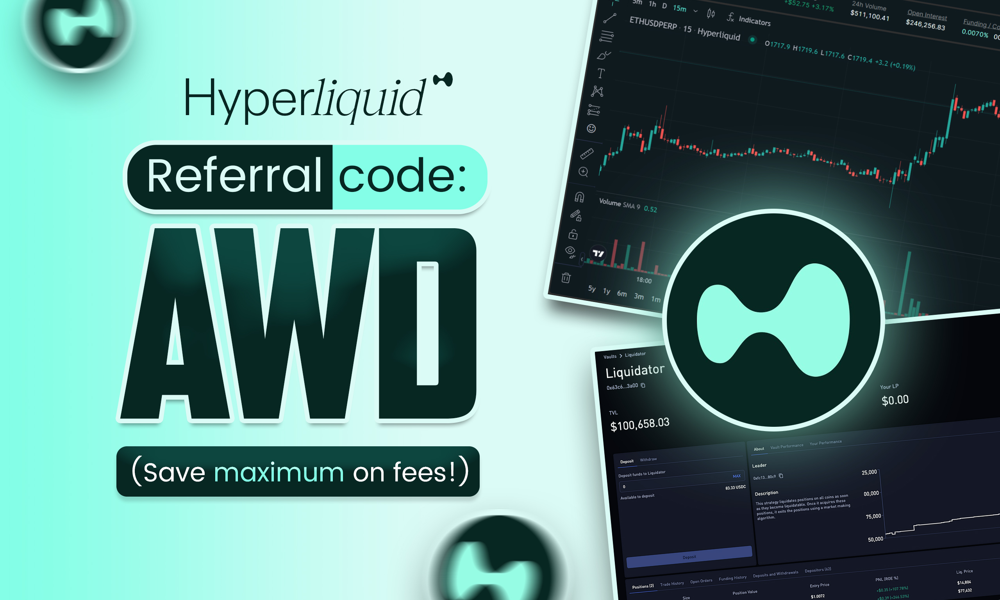

# Hyperliquid Referral Code: `AWD` — Save 4% on Trading Fees (Maximum Discount 2026)

## Hyperliquid Referral Code `AWD` — 4% Fee Discount (Highest Available)

| | |
|---|---|
| **Referral Code** | **`AWD`** |
| **Discount** | 4% off all trading fees (maximum) |
| **Applies To** | First $25M in trading volume |
| **Network** | Hyperliquid L1 |
| **Expires** | Never |
| **Activate Now** | **[app.hyperliquid.xyz/join/AWD](https://app.hyperliquid.xyz/join/AWD)** |

The Hyperliquid referral code **`AWD`** gives you a **4% discount on all trading fees** — the maximum referral discount available on Hyperliquid. The discount applies to every trade you make for your first $25 million in volume.

> **Quick start:** Click **[this link](https://app.hyperliquid.xyz/join/AWD)** to open Hyperliquid with the code `AWD` already applied. Connect your wallet and the discount activates instantly.

---

## Table of Contents

- [How to Use the Referral Code AWD](#how-to-use-the-hyperliquid-referral-code-awd)
- [How Much You Save (Calculator)](#how-much-can-you-save-with-code-awd)
- [Hyperliquid Fee Structure](#hyperliquid-complete-fee-structure)
- [Stack Referral + Staking Discounts](#stack-your-savings-referral--staking-discounts)
- [Getting Started From Scratch](#getting-started-with-hyperliquid-from-scratch)
- [How to Bridge USDC to Hyperliquid](#how-to-bridge-usdc-to-hyperliquid)
- [What is Hyperliquid?](#what-is-hyperliquid)
- [All Trading Pairs](#hyperliquid-trading-pairs)
- [Hyperliquid vs Centralized Exchanges](#hyperliquid-vs-centralized-exchanges)
- [Hyperliquid vs Other DEXs](#hyperliquid-vs-other-dexs)
- [The HYPE Token](#the-hype-token)
- [Gasless Trading (2026 Update)](#gasless-perp-trading-march-2026-update)
- [Troubleshooting](#hyperliquid-referral-code-not-working)
- [FAQ](#frequently-asked-questions)

---

## How to Use the Hyperliquid Referral Code AWD

It takes under 30 seconds:

### Step 1 — Open the Referral Link

Click the link below. The code `AWD` is automatically attached:

**[https://app.hyperliquid.xyz/join/AWD](https://app.hyperliquid.xyz/join/AWD)**

### Step 2 — Connect Your Wallet

Click **"Connect"** and select your wallet. Hyperliquid supports:

- MetaMask
- Rabby
- Coinbase Wallet
- WalletConnect
- Any EVM-compatible wallet

### Step 3 — Deposit USDC

Deposit USDC to start trading. Hyperliquid uses **USDC as the settlement currency** for all perpetual trades. You can bridge USDC from Arbitrum or other chains (see [bridging guide below](#how-to-bridge-usdc-to-hyperliquid)).

### Step 4 — Trade With 4% Off

Place your first trade. The 4% fee discount is now active on your account for your first $25 million in trading volume.

### Step 5 — Verify the Code

Go to **[app.hyperliquid.xyz/referrals](https://app.hyperliquid.xyz/referrals)** to confirm the code `AWD` is active on your account.

> **Already using a different code?** You can enter a new referral code at [app.hyperliquid.xyz/referrals](https://app.hyperliquid.xyz/referrals) if you haven't already applied one. Referral codes can only be set once per account.

---

## How Much Can You Save With Code AWD?

### Perps: Savings Per Trade (Base Tier — 0.045% Taker Fee)

| Position Size | Normal Fee | With AWD (4% off) | You Save |
|--------------|-----------|-------------------|----------|
| $1,000 | $0.45 | $0.432 | $0.018 |
| $5,000 | $2.25 | $2.16 | $0.09 |
| $10,000 | $4.50 | $4.32 | $0.18 |
| $25,000 | $11.25 | $10.80 | $0.45 |
| $50,000 | $22.50 | $21.60 | $0.90 |
| $100,000 | $45.00 | $43.20 | $1.80 |

### Monthly Savings for Active Traders

| Trades per Day | Avg Position Size | Monthly Savings |
|---------------|------------------|----------------|
| 5 | $10,000 | ~$27 |
| 10 | $25,000 | ~$135 |
| 20 | $50,000 | ~$540 |
| 50 | $100,000 | ~$2,700 |

These savings are **per side** — each round-trip trade (open + close) saves you the discount twice.

Over $25M in cumulative volume, the referral code `AWD` saves you a total of approximately **$450 in taker fees** at the base tier rate.

---

## Hyperliquid Complete Fee Structure

Hyperliquid uses a tiered fee system based on your rolling 14-day trading volume.

### Perpetual Trading Fees

| Tier | 14-Day Volume | Taker Fee | Maker Fee |
|------|--------------|-----------|-----------|
| 0 (Base) | $0+ | 0.045% | 0.015% |
| 1 | >$5M | 0.040% | 0.012% |
| 2 | >$25M | 0.035% | 0.008% |
| 3 | >$100M | 0.030% | 0.004% |
| 4 | >$500M | 0.028% | 0.000% |
| 5 | >$2B | 0.026% | 0.000% |
| 6 | >$7B | 0.024% | 0.000% |

### Spot Trading Fees

| Tier | 14-Day Volume | Taker Fee | Maker Fee |
|------|--------------|-----------|-----------|
| 0 (Base) | $0+ | 0.070% | 0.040% |
| 1 | >$5M | 0.060% | 0.030% |
| 2 | >$25M | 0.050% | 0.020% |
| 3 | >$100M | 0.040% | 0.010% |
| 4 | >$500M | 0.035% | 0.000% |
| 5 | >$2B | 0.030% | 0.000% |
| 6 | >$7B | 0.025% | 0.000% |

The 4% referral discount from code `AWD` applies **on top of** your volume-based tier, reducing whatever fee you're paying by an additional 4%.

**Key fee modifiers:**
- Spot volume counts **double** toward tier determination
- Aligned quote assets get 20% lower taker fees and 50% better maker rebates
- Maker rebates become available at higher volume thresholds (-0.001% to -0.003%)

---

## Stack Your Savings: Referral + Staking Discounts

Hyperliquid offers additional fee discounts based on how much HYPE you stake. These **stack with** the referral code discount:

| HYPE Staked | Staking Discount | Combined with Referral (AWD) |
|-------------|-----------------|------------------------------|
| 10+ | 5% | ~9% total discount |
| 100+ | 10% | ~14% total discount |
| 1,000+ | 15% | ~19% total discount |
| 10,000+ | 20% | ~24% total discount |
| 100,000+ | 30% | ~34% total discount |
| 500,000+ | 40% | ~44% total discount |

This means by using the referral code `AWD` and staking HYPE, you can reduce your trading fees significantly beyond the base 4% referral discount.

**Example:** At the base tier (0.045% taker), staking 1,000 HYPE and using code `AWD`:
- Base fee: 0.045%
- After 4% referral discount: 0.0432%
- After 15% staking discount: ~0.0367%
- **Total savings: ~18.4% off the base fee**

---

## Getting Started With Hyperliquid From Scratch

New to Hyperliquid? Here is the complete guide from zero to your first trade:

### 1. Get a Web3 Wallet

Install **[MetaMask](https://metamask.io/)** or **[Rabby](https://rabby.io/)**. Write down your seed phrase and store it securely.

### 2. Get USDC

Hyperliquid uses **USDC** as collateral for all perpetual trades. Buy USDC on any exchange (Coinbase, Kraken, Binance).

### 3. Bridge USDC to Hyperliquid

Transfer your USDC to the Hyperliquid L1 chain (see [bridging guide below](#how-to-bridge-usdc-to-hyperliquid)).

### 4. Open Hyperliquid With Code AWD

Click **[app.hyperliquid.xyz/join/AWD](https://app.hyperliquid.xyz/join/AWD)** and connect your wallet.

### 5. Deposit Funds

Click **"Deposit"** and transfer USDC from your wallet to your Hyperliquid trading account.

### 6. Place Your First Trade

- Select a trading pair (e.g., BTC-PERP, ETH-PERP)
- Choose **Long** or **Short**
- Set your leverage (up to 50x on majors)
- Set your position size
- Optionally add TP/SL (take-profit / stop-loss)
- Click **Place Order** — the 4% fee discount is already active

### 7. Manage Positions

View and manage your positions in the **Positions** tab. You can:
- Adjust leverage on open positions
- Add or remove margin
- Set or modify TP/SL orders
- Close partially or fully

---

## How to Bridge USDC to Hyperliquid

Hyperliquid runs on its own L1 chain. You need to bridge USDC to start trading.

### Option 1: Bridge From Arbitrum (Recommended)

1. Go to **[app.hyperliquid.xyz](https://app.hyperliquid.xyz/join/AWD)**
2. Click **"Deposit"**
3. Select **Arbitrum** as the source chain
4. Enter the amount of USDC to bridge
5. Approve and confirm the transaction
6. Funds arrive in ~1-2 minutes

This is the most common and cheapest method.

### Option 2: Direct Withdrawal From an Exchange

Some exchanges support direct withdrawals to Hyperliquid L1 or to Arbitrum:
- **Coinbase** — Withdraw USDC to Arbitrum, then bridge
- **Binance** — Withdraw USDC to Arbitrum
- **Bybit** — Supports Arbitrum USDC withdrawals
- **Kraken** — Supports Arbitrum withdrawals

### Option 3: Use a Third-Party Bridge

Bridges like **Stargate**, **Synapse**, or **Across** can move USDC from other chains to Arbitrum, which you then bridge to Hyperliquid.

**Tip:** Always keep a small amount of ETH on Arbitrum for gas fees when bridging. The gas cost is typically less than $0.10.

---

## What is Hyperliquid?

Hyperliquid is a **high-performance decentralized perpetual exchange** built on its own Layer 1 blockchain. It has rapidly become one of the largest DEXs by volume, regularly processing **over $10 billion in daily trading volume** with hundreds of thousands of active traders.

### Why Traders Choose Hyperliquid

- **Speed** — Sub-second trade execution on a purpose-built L1
- **No KYC** — Connect your wallet and trade immediately
- **No gas fees on trades** — Gas is handled by the protocol (as of March 2026)
- **Deep liquidity** — Consistently among the highest volume perp DEXs
- **CEX-like experience** — Order book, limit orders, TP/SL, advanced order types
- **100+ trading pairs** — Majors, altcoins, memecoins, and more
- **Up to 50x leverage** — On major pairs like BTC and ETH
- **Non-custodial** — Your funds stay in your control
- **Transparent** — All orders and trades visible on-chain

### How Hyperliquid Works

Unlike AMM-based DEXs, Hyperliquid uses a **fully on-chain order book**. This gives it a trading experience similar to centralized exchanges:

- **Order book matching** — Real limit orders, not AMM swaps
- **Sub-second finality** — The Hyperliquid L1 processes transactions in under 1 second
- **Oracle prices** — Uses its own oracle system for mark prices and liquidations
- **HLP vault** — The Hyperliquid Liquidity Provider vault acts as market maker, providing deep liquidity across all pairs

Hyperliquid processes over **200,000 orders per second**, making it one of the fastest DEXs in existence.

---

## Hyperliquid Trading Pairs

Hyperliquid supports **100+ perpetual trading pairs** and a growing number of spot pairs.

### Major Pairs

| Pair | Max Leverage |
|------|-------------|
| BTC-PERP | 50x |
| ETH-PERP | 50x |
| SOL-PERP | 50x |

### Popular Altcoin Pairs

| Pair | Max Leverage |
|------|-------------|
| ARB-PERP | 20x |
| AVAX-PERP | 20x |
| DOGE-PERP | 20x |
| LINK-PERP | 20x |
| OP-PERP | 20x |
| MATIC-PERP | 20x |
| SUI-PERP | 20x |
| APT-PERP | 20x |
| INJ-PERP | 20x |
| TIA-PERP | 20x |
| SEI-PERP | 20x |
| NEAR-PERP | 20x |
| FTM-PERP | 20x |
| AAVE-PERP | 20x |
| UNI-PERP | 20x |
| MKR-PERP | 20x |
| LDO-PERP | 20x |
| CRV-PERP | 20x |
| RUNE-PERP | 20x |
| STX-PERP | 20x |

### Memecoin Pairs

| Pair | Max Leverage |
|------|-------------|
| PEPE-PERP | 20x |
| WIF-PERP | 20x |
| BONK-PERP | 20x |
| SHIB-PERP | 20x |
| FLOKI-PERP | 20x |
| MEME-PERP | 20x |

### Spot Trading

Hyperliquid also supports spot trading for select tokens including HYPE, PURR, and other tokens deployed via HIP-1 and HIP-2.

New pairs are added regularly. Check the [Hyperliquid app](https://app.hyperliquid.xyz/join/AWD) for the latest list.

---

## Hyperliquid vs Centralized Exchanges

| Feature | Hyperliquid (with code AWD) | Binance | Bybit | OKX |
|---------|---------------------------|---------|-------|-----|
| **Taker fee** | 0.0432% (after 4% discount) | 0.02% - 0.04% | 0.02% - 0.055% | 0.02% - 0.05% |
| **Maker fee** | 0.0144% (after 4% discount) | 0.01% - 0.02% | 0.01% - 0.02% | 0.01% - 0.02% |
| **KYC required** | No | Yes | Yes | Yes |
| **Fund custody** | Your wallet | Exchange | Exchange | Exchange |
| **Leverage** | Up to 50x | Up to 125x | Up to 100x | Up to 125x |
| **Order book** | On-chain | Off-chain | Off-chain | Off-chain |
| **US available** | Yes | No | No | No |
| **Gas fees** | None (rebated in HYPE) | N/A | N/A | N/A |
| **Execution speed** | Sub-second | Sub-second | Sub-second | Sub-second |
| **Counterparty risk** | Smart contract only | Exchange insolvency | Exchange insolvency | Exchange insolvency |

Hyperliquid fees are competitive with centralized exchanges, and you gain **no KYC, self-custody, no geographic restrictions, and gasless trading**.

---

## Hyperliquid vs Other DEXs

| Exchange | Taker Fee | Maker Fee | With Best Referral | Chain |
|----------|-----------|-----------|-------------------|-------|
| **Hyperliquid (code AWD)** | 0.045% | 0.015% | **0.0432% / 0.0144%** | Hyperliquid L1 |
| GMX | 0.05% - 0.07% | 0.05% - 0.07% | 0.045% - 0.063% | Arbitrum |
| dYdX | 0.02% - 0.05% | 0.00% - 0.02% | Varies | dYdX Chain |
| Vertex | 0.02% - 0.04% | 0.00% | 0.015% - 0.03% | Arbitrum |
| Jupiter Perps | 0.06% - 0.09% | N/A | N/A | Solana |
| Gains Network | 0.08% | 0.08% | 0.072% | Arbitrum |

Hyperliquid stands out with its **combination of low fees, on-chain order book, and CEX-like execution speed**. It is the highest-volume perp DEX for a reason.

---

## The HYPE Token

HYPE is the native token of the Hyperliquid ecosystem. It serves several purposes:

### Staking
- Stake HYPE to earn fee discounts (5% to 40% depending on amount staked)
- Staking discounts **stack with** the referral code discount
- Stake at [app.hyperliquid.xyz/staking](https://app.hyperliquid.xyz/staking)

### Gas Fee Rebates
- As of March 2026, perp trading gas fees are rebated in HYPE tokens
- This effectively makes perpetual trading **gasless**

### Governance
- HYPE holders participate in protocol governance
- Vote on proposals affecting the protocol's development

### Ecosystem
- HYPE is used as the native gas token on the Hyperliquid L1
- Required for deploying tokens via HIP-1 and HIP-2
- Used across Hyperliquid's growing DeFi ecosystem

---

## Gasless Perp Trading (March 2026 Update)

As of March 2026, Hyperliquid rebates **100% of maker and taker gas fees** for perpetual trading directly back to users in HYPE tokens. This means:

- You pay zero gas fees for perp trades
- Rebates are calculated and distributed at the end of each trading session
- This applies to all retail (non-VIP) accounts
- Combined with the referral code `AWD`, you get both **gasless trades** and **4% lower trading fees**

This makes Hyperliquid one of the most cost-effective platforms for perpetual trading in crypto.

---

## Hyperliquid Referral Code Not Working?

### Code Shows as Invalid
- Referral codes are **case-sensitive**. Enter `AWD` exactly (all uppercase)
- Use the direct link: **[app.hyperliquid.xyz/join/AWD](https://app.hyperliquid.xyz/join/AWD)**

### Already Have a Referral Code
- Hyperliquid only allows one referral code per account. If you already applied a different code, it cannot be changed

### Discount Not Showing
- The 4% discount is applied automatically — check the fee details in your trade confirmation
- The discount applies for your first $25M in cumulative volume. After that, volume-based tier discounts take over

### Deposit Not Arriving
- Make sure you're bridging USDC (not USDT or other tokens) from Arbitrum
- Check that your wallet is connected to the correct network
- Bridge transactions typically complete in 1-2 minutes

### Cannot Connect Wallet
- Clear your browser cache and try again
- Try a different browser
- Ensure your wallet extension is up to date
- Disable other browser extensions that might conflict

---

## Frequently Asked Questions

### Is the Hyperliquid referral code AWD legit?
Yes. `AWD` is a verified referral code on Hyperliquid that provides the maximum 4% fee discount. You can confirm it at [app.hyperliquid.xyz/referrals](https://app.hyperliquid.xyz/referrals).

### How much discount does the referral code give?
The code `AWD` gives you a **4% discount on all trading fees**. This is the maximum referral discount available on Hyperliquid — all referral codes give the same 4%.

### Does the referral code expire?
The code itself never expires. However, the 4% discount applies to your **first $25 million in trading volume**. After reaching $25M, you transition to volume-based tier discounts.

### Can I change my Hyperliquid referral code?
No. Hyperliquid only allows one referral code per account. Once a code is applied, it cannot be changed. Make sure to use `AWD` before applying any other code.

### Can I stack the referral discount with staking discounts?
Yes. The 4% referral discount and HYPE staking discounts stack together. For example, staking 1,000 HYPE (15% discount) plus the referral code gives you approximately 19% total fee reduction.

### What is the maximum discount I can get?
By combining the referral code (4%), staking 500,000+ HYPE (40%), and reaching higher volume tiers, you can reduce your fees by over 40% compared to the base rate.

### Does the referral discount apply to spot trading?
Yes. The 4% discount applies to both perpetual and spot trading fees.

### Do I need KYC to use Hyperliquid?
No. Hyperliquid is fully decentralized and requires no KYC. Connect your wallet and start trading immediately.

### What wallets work with Hyperliquid?
Any EVM-compatible wallet: MetaMask, Rabby, Coinbase Wallet, Trust Wallet, Ledger (via WalletConnect), Rainbow, and others.

### Is Hyperliquid safe?
Hyperliquid has been live since 2023 and processes billions in daily volume. It runs on its own L1 with a fully on-chain order book. However, as with any DeFi protocol, smart contract risks exist. Only trade with funds you can afford to lose.

### Can I use Hyperliquid in the United States?
Yes. Hyperliquid is a decentralized protocol with no geographic restrictions or KYC requirements. Anyone with an EVM wallet can access it.

### How fast is Hyperliquid?
Hyperliquid's L1 processes transactions with sub-second finality and can handle over 200,000 orders per second. Trade execution feels similar to centralized exchanges.

### What is the HLP vault?
HLP (Hyperliquid Liquidity Provider) is a vault that acts as the primary market maker on Hyperliquid. Users can deposit USDC into HLP to earn a share of market-making profits. This provides the deep liquidity that makes Hyperliquid competitive with CEXs.

### Does the referral discount apply to sub-accounts and vaults?
No. Referral discounts do not apply to vaults or sub-accounts, as these are treated as independent accounts in the clearinghouse.

---

## Start Trading With 4% Off — Use Code AWD

The referral code `AWD` saves you 4% on every trade for your first $25M in volume. No expiration, no minimum deposit, no KYC.

### **[Click here to trade on Hyperliquid with referral code AWD](https://app.hyperliquid.xyz/join/AWD)**

| | |
|---|---|
| **Referral Code** | `AWD` |
| **Your Discount** | 4% off trading fees (maximum) |
| **Activate** | [app.hyperliquid.xyz/join/AWD](https://app.hyperliquid.xyz/join/AWD) |
| **Volume Cap** | First $25M in volume |
| **Expires** | Never |

---

*Last updated: March 2026*
